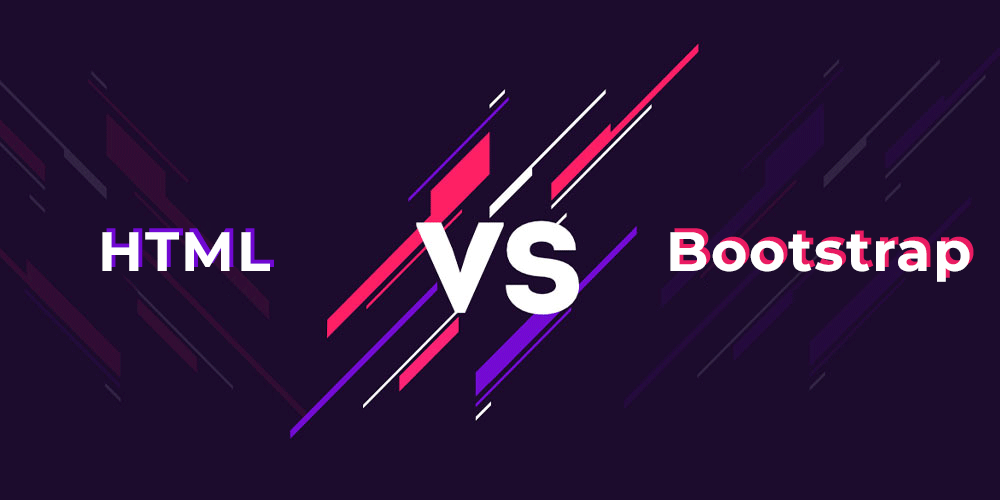

## HTML

HTML, or Hypertext Markup Language, is the standard markup language used to create web pages. It's a foundational technology that has powered the World Wide Web for decades. Given its longevity and widespread adoption, HTML has many advantages:HTML is a universal standard that is recognized and used worldwide. HTML can be understood by any device or browser that supports web content, making it the most accessible way to display information on the web. Even someone new to web development can pick up the basics of HTML relatively quickly. Its syntax is simple and clear, and there are plenty of tutorials and resources for beginners to get started easily. It does not require expensive tools or software; a simple text editor, such as Notepad, is enough to write HTML. Moreover, HTML is highly versatile. It can be integrated with other languages such as CSS and JavaScript to create dynamic and interactive web pages.

<li>Display Consistency</li>

One of the core principles of web development is ensuring that web content displays and runs consistently across browsers. With the help of standards provided by the World Wide Web Consortium (W3C), developers can follow guidelines that ensure consistent rendering. HTML code can be executed on any platform without any modification, and HTML tends to be displayed consistently across various browsers and platforms. Whether it's Windows, Linux, macOS, or mobile platforms, HTML remains consistent. For instance, mature browsers such as Chrome, Firefox, Safari, and Edge constantly update their rendering engines to support the latest HTML standards. However, they also maintain compatibility with older versions of HTML to ensure that older websites remain accessible and functional.

The DOCTYPE declaration helps browsers understand which version of HTML the page uses. Placing the `DOCTYPE` declaration at the beginning of the HTML document can further improve consistency by telling the browser which set of rules to follow.

Example: <!DOCTYPE html>. A CSS reset is an important tool for web developers. Sometimes, differences in default browser styles can lead to inconsistent presentations. Thus, many developers use the CSS reset technique to standardize default browser styles, ensuring a consistent starting point. Each browser has its own default "user agent" style sheet, which it uses to display unstyled web pages in a specific way. These default styles vary from browser to browser, leading to inconsistent appearances. CSS resets are a set of styles that remove or neutralize the default margins, padding, and other properties provided by browsers. The idea behind a CSS reset is to "reset" styles, creating a consistent starting point. By using a CSS reset, developers can ensure they start from a consistent baseline, making it easier to apply custom styles.

<li>Multimedia</li>

HTML supports multimedia and accommodates various multimedia elements such as images, videos, and audios through tags like ``, `<video>`, and `<audio>`. This capability allows rich content to be presented on a website. The `` tag facilitates the embedding of images in web pages, supporting formats like JPEG, PNG, GIF, BMP, WEBP, and more. Attributes like "alt" provide alternative text descriptions for accessibility, while "srcset" offers responsive image solutions for various device resolutions. The `<audio>` element, introduced in HTML5, can embed audio files and supports formats like MP3, OGG, and WAV. Controls such as play, pause, and volume can be easily added. The `<video>` tag, also a part of HTML5, aids in the integration of video files, supporting formats like MP4, WebM, and OGG. It also permits properties like "controls" (play, pause, volume) and "poster". The inclusion of multimedia features in HTML has metamorphosed static pages into dynamic, interactive, and engaging digital platforms. Not only does this elevate user engagement, but it also equips creators with the tools to showcase content in diverse and imaginative ways. From straightforward graphics to intricate animations and high-definition videos, HTML's multimedia support facilitates a broad spectrum of digital experiences.

In conclusion, HTML is the backbone of the web. Its strengths derive from its simplicity, versatility, and adaptability. Whether you aim to construct a personal portfolio, a multimedia website, or a data-driven web application, HTML is the foundational layer upon which digital experiences are crafted.

 

## Bootstrap 5

In the contemporary digital landscape, user interface (UI) frameworks have come to the forefront, playing a key role in web development. For those unfamiliar with these tools, they might seem like mere version updates. "Maybe HTML and CSS are enough for our needs?" one might ask. Let's delve into the intriguing world of UI frameworks and learn more about Bootstrap 5.

<li>Predefined Components</li>

With Bootstrap 5, predefined components swiftly transform your ideas into tangible designs, enabling developers to assemble functional prototypes effortlessly. In today's world, where people access the web from numerous devices, responsiveness is crucial. As the variety of device types and screen sizes grows, possessing a flexible and robust grid system becomes vital. Bootstrap 5 is crafted to simplify the creation of responsive, elegant designs catering to both mobile and desktop users. Whether you're laying out intricate web applications or constructing content-rich websites, Bootstrap 5 provides a grid system and components that automatically adjust based on the device screen size.

Bootstrap 5 introduced an additional breakpoint, termed the XXL grid layer. This breakpoint caters specifically to large desktop screens with a minimum width of 1400 pixels. With this enhancement, Bootstrap now encompasses a comprehensive set of breakpoint ranges: xs (extra small), sm (small), md (medium), lg (large), xl (extra large), and xxl. This ensures web content displays optimally across a broad spectrum of devices. The ".container" class has been enhanced, with the introduction of the new ".container-xxl" class, specifically designed for the XXL grid layer to optimize layouts for larger screens. Furthermore, there's a fluid container class, ".container-fluid", ensuring content occupies the full width of its container, spanning the entire viewport.

<li>Modular</li>

Bootstrap 5 adopts a modular approach, allowing developers to incorporate only the segments of the framework they require, leading to more streamlined, faster-loading web projects. The Sass module stands out in Bootstrap 5. Bootstrap's Sass files boast a modular arrangement, meaning various components and utilities are distributed into distinct files and directories. If a developer wishes to customize or omit a particular component, they can simply import or bypass the relevant Sass file, affording more flexibility and deeper customization options. Theming Bootstrap becomes effortless with the prowess of Sass variables and mappings. Developers can craft multiple themes, each with unique color palettes, typography, and component designs, all while utilizing the foundational Bootstrap framework.

Bootstrap 5 introduces its proprietary open-source icon library, which is free to use. This integrated icon library offers an extensive collection of SVG (Scalable Vector Graphics) icons, harmonizing with the Bootstrap framework's aesthetics. The inclusion of this library negates the need for external services or resources, which accelerates load times and reduces the potential for service interruptions that might degrade the user experience. Bootstrap 5 icons are versatile, suitable for diverse applications, from navigation bars and buttons to complex components. Integrating these icons into your project is straightforward. Once the library is incorporated, icons can be added with basic HTML markup.

## Comparison

Certainly, both Bootstrap 5 and HTML are pivotal tools in the realm of web development, albeit serving distinct roles and bearing unique attributes. Bootstrap 5, conceived with a mobile-first ideology, equips developers with a consistent framework, ensuring web designs remain responsive and maintain uniformity in design and functionality across varied devices. Enhanced by its integration with Sass, Bootstrap 5 promotes deep customization of its components to resonate with distinct designs. It boasts a plethora of ready-to-use components, ranging from navigation bars to modals, fostering a more rapid developmental process. Additionally, its sophisticated grid system augments flexibility in layout creation. However, a notable caveat is the potential for Bootstrap websites to exude a sense of homogeneity unless subjected to substantial customization. Moreover, while Bootstrap does streamline myriad tasks, it demands that developers acquaint themselves with its unique classes and components.

 On the other hand, HTML stands as the bedrock markup language for the web, a universal language inherently understood and rendered by all web browsers. Its syntax, characterized by simplicity, serves as an ideal starting point for novices. A salient strength of HTML lies in its ability to seamlessly integrate with auxiliary languages like CSS and JavaScript, paving the way for enriched, dynamic web experiences. Furthermore, when meticulously penned, HTML tends to render with remarkable consistency across diverse browsers. Yet, it's crucial to acknowledge its inherent limitations: when devoid of the bolstering capabilities of CSS or JavaScript, HTML remains static, incapable of delivering dynamic or interactive content autonomously. Its rudimentary styling capabilities may fall short in sculpting content, necessitating the integration of CSS for more advanced styling or animations. When the challenge rises to craft complex web applications or immersive websites, HTML's capabilities must be supplemented with other technologies, thereby intensifying the complexity of development. 

In summary, while HTML forms the foundational language upon which web content is built, Bootstrap 5 emerges as a potent CSS/JS framework tailored to simplify the nuances of web application design and responsiveness. It's also imperative to recognize that while Bootstrap is fundamentally tethered to HTML for its structural essence, the reverse doesn't hold true; HTML operates independently, devoid of any intrinsic reliance on Bootstrap.

## Conclusion

In the world of software development, coding standards are more than just a formality. They are the pillars upon which software engineering quality is built. The many benefits of adhering to coding standards include consistency, readability, reduced errors, and increased learning opportunities. Although the process of using ESLint and IntelliJ can be challenging initially, and the process of getting a green checkmark in ESLint can be difficult, a green checkmark is a symbol of code quality and adherence to coding standards. Not only have ESLint and IntelliJ improved the quality of our code over time, but in team projects these tools are integral to ensuring that all contributors move forward according to established standards.

As the field of software development continues to expand and projects increase in scale, the significance of coding standards becomes increasingly evident. Coding standards are as vital as English grammar; they serve as guiding principles for developers in navigating the intricacies of programming languages. These standards ensure that their creations are not only functional but also maintainable and easily comprehensible.
