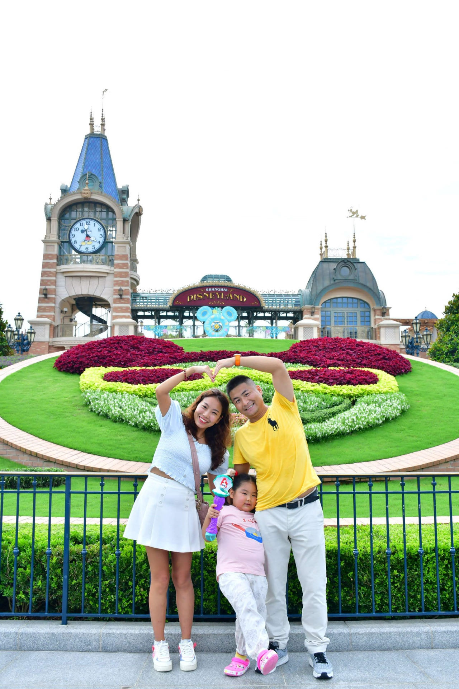

Amidst the hustle and bustle of modern life, finding moments of genuine joy and bonding becomes paramount. Such moments are beautifully encapsulated in the memories of our family's remarkable vacation to Disneyland—a journey of shared laughter, magical encounters, and the deepening of bonds between my wife, my daughter, and myself. As I reflect upon this enchanting adventure, I am reminded of the irreplaceable value of quality time spent with loved ones in a place that ignites the imagination and warms the heart.

## The Power of Family Togetherness

Our vacation to Disneyland was more than just a trip; it was a celebration of family togetherness. With my wife and daughter by my side, the adventure was enriched by the love and companionship that only close family can provide. The anticipation in the days leading up to the vacation was palpable, and as we set foot in the magical realm, it was as if the weight of everyday responsibilities had lifted, leaving room for carefree enjoyment.

## A Shared Dreamland

The moment we stepped through the gates of Disneyland, we were transported into a world where fantasies come alive. The iconic Sleeping Beauty Castle welcomed us with open arms, its towers reaching towards the sky as if inviting us to explore the realms of magic and wonder. Main Street, U.S.A. charmed us with its nostalgic architecture and bustling energy, setting the tone for the enchanting journey that lay ahead. Together, as a family, we embarked on a shared dreamland where excitement and delight knew no bounds.

## Magical Encounters and Immersement

For my daughter, encountering beloved Disney characters in person was a dream come true. The sparkle in her eyes as she hugged her favorite princesses and heroes was a testament to the sheer magic of the experience. As parents, my wife and I were equally captivated by the immersive environments of each themed land. Whether we were traversing through the jungles of Adventureland or exploring the futuristic vistas of Tomorrowland, the attention to detail and craftsmanship ignited our imaginations, making us feel like characters in our own story.

 laughter, love, and the enchantment of being together.
